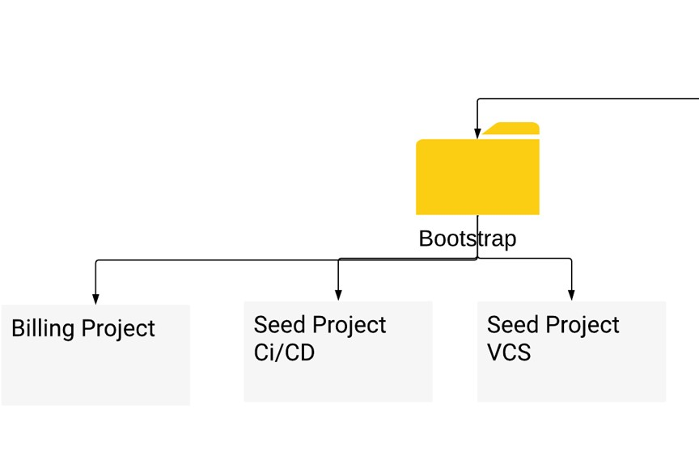
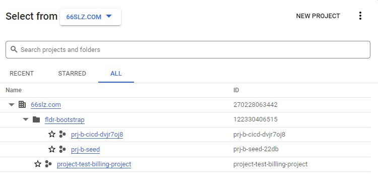
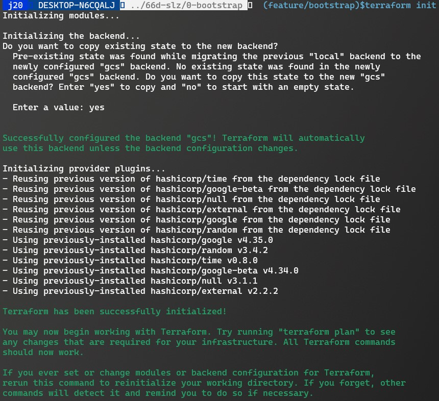

# How to start with Bootsraping. 

## Pre-requisites. 

1. Your IAM user should have the following permissions in xx organization
   1. Folder Admin
   2. Logging Admin
   3. Organization Administrator
   4. Organization Policy Administrator
   5. Owner
   6. Security Admin
   7. Service Account Admin
   8. Billing Account Costs Manager (From Billing account More Info Panel)

2. XX should also configure two Groups similar to them, 
   1. group_org_admins_local_test@66slz.com
   2. group_billing_admins_local_test@66slz.com

3. A billing Account  

---
---
# Bootstrap Overview 
high Level View



1. Full Version creates the following, 



```
└── organization
    ├── fldr-bootstrap
    │   ├── prj-cicd
    │   │   ├── create-cloud-build-triggers
    │   │   │   ├── gcp-environment-apply
    │   │   │   ├── gcp-environment-plan
    │   │   │   ├── gcp-network-apply
    │   │   │   ├── gcp-network-plan
    │   │   │   ├── gcp-org-apply
    │   │   │   ├── gcp-org-plan
    │   │   │   ├── gcp-projects-apply
    │   │   │   ├── gcp-projects-plan
    │   │   │   └── tf-cloud-builder-build
    │   │   ├── creates-cloud-build-triggers-gcs-logging-bucket
    │   │   │   ├── gcp-environment-apply
    │   │   │   ├── gcp-environment-plan
    │   │   │   ├── gcp-network-apply
    │   │   │   ├── gcp-network-plan
    │   │   │   ├── gcp-org-apply
    │   │   │   ├── gcp-org-plan
    │   │   │   ├── gcp-projects-apply
    │   │   │   ├── gcp-projects-plan
    │   │   │   └── tf-cloud-builder-build
    │   │   └── creates-vcs-repos
    │   │       ├── gcp-bootstrap
    │   │       ├── gcp-environments
    │   │       ├── gcp-org
    │   │       ├── gcp-policies
    │   │       └── gcp-projects
    │   └── prj-seed
    │       ├── creates-sa
    │       │   ├── org-terraform@project.iam.gserviceaccount.com // For Running CICD's we use use this SA. 
    │       │   ├── terraform-env-sa@project.iam.gserviceaccount.com
    │       │   ├── terraform-net-sa@project.iam.gserviceaccount.com
    │       │   ├── terraform-org-sa@project.iam.gserviceaccount.com
    │       │   └── terraform-proj-sa@project.iam.gserviceaccount.com
    │       └── creates-tf-state-bucket
    │           └── bkt-b-tfstate-postfix
    └── project-test-billing-project
        └── billing-project-required-for-groups

```
## Using the Bootsrap module

There are four terraform files ( *.tf ) in the root of "0-bootstrap" directory and four terraform tfvars files inside "0-bootstrap/66slz" directory 

1. We only need to focus on "0-bootstrap/66slz" where we have the four tfvars files. 

```
66slz/
├── cb.tfvars // creates the cloud-builder-cicd-project ( can be opted if not required )
├── groups.tfvars // creates groups ( optional can be opted out if not required )
├── main.tfvars // creates the seed project
└── sa.tfvars // creates required servic accounts
```

Once the required tfvars file are updated, 

```
We deploy the Bootstrap in twho phases. 
    i. (PHASE-I) Running Terraform locally considering following
        a. comment backend.tf section 
            i. Since we don't have any state bucket created, we are storing the state locally for the first phase. ( will be migrated later )
            ii. state bucket will be created inside seed-project
            iii. Keep the groups.tfvars section commented. 
    ii. (PHASE-II) Running Terraform with the following,  
        a. Once the Phase-I is executed successfully, 
            i. Uncomment the backend.tf to make it effect
                and run $terraform init
                    a. This time, initializtion would find the change in backend and ask you to migrate from promt. 
```



```
            ii. Use groups.tfvars section if needed. 
                a. Important-note: if you want groups to get created, you need to add serviceaccount "org-terraform@project.iam.gserviceaccount" as group admin. 
```


    a. A Root Folder with a prefix "prefix-bootstrap"
        i. Project for "GCP managed VCS and CICD"
            i. This is required, when XX needs Google managed VCS and Cloud Build Pipelines for CICD 
        ii. Project "prefix-seed"
            i. This Project is the seed project, where happens the following,
                a. terraform-proj-sa@prj-b-seed-22db.iam.gserviceaccount.com
                b. terraform-org-sa@prj-b-seed-22db.iam.gserviceaccount
                c. comterraform-env-sa@prj-b-seed-22db.iam.gserviceaccount.com
                d. terraform-net-sa@prj-b-seed-22db.iam.gserviceaccount.com
                e. org-terraform@prj-b-seed-22db.iam.gserviceaccount.com 

            ii. Creates a Service-account "org-terraform@prj-b-seed-22db.iam.gserviceaccount.com" to manage the Authenticates the CICD pipeline to deploy the resources in GCP. 
                a. Need to manually assign permission to this service account Once Phase-1 is done. 
        

